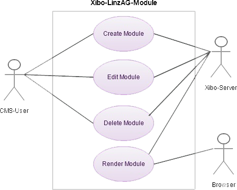
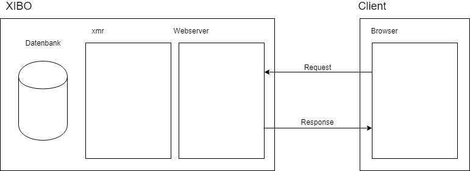

# Xibo LinzAG Module

## Anwendungsfalldiagramm

    

## Systemarchitektur

    

## Installation
Nach dem Klonen muss der Ordner "LinzAG" und die JSON-Datei "linzag.json" in den Xibo "/Custom" Ordner hineingegeben werden.
Danach kann man das Modul unter "Module-Modul installieren" hinzufügen.

    
    

    
    

    
    

Nach der Installation müssen die Icons hochgeladen werden. Diese befinden sich im "resource"-Ordner.

    
    

Anschließend ist es möglich das Modul einem Layout zuzuweisen. Dabei kann man mehrere Haltestellen inkludieren. 
Diese müssen aber mit einem ";" getrennt werden. 
Die maximale Zeilenanzahl bei der Ausgabe ist hier festzulegen.

    
    

Am Ende sollte es in etwa so aussehen:

    

