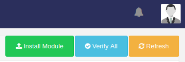

# Xibo Departure-Monitor Module

## Installation
Download the latest release [here](https://github.com/halilbahar/xibo-departure-monitor-module/releases/latest) and extract it to the custom folder. You may need root privileges.
```
sudo tar -zxvf departure-monitor.tar.gz -C /path/to/xibo/custom/
```

### After getting the files to the custom folder:
On the left panel, under administration, go to Modules and click on Install Module and select Departure-Monitor. Now the module is installed.
xibo-departure-monitor-module

<div>
    
    
</div>

## Usage

### Single region
If you have only one region you can set the region's duration as long as you would like to.

### Multiple regions
When you have multiple regions disable the loop option for the region with this module and leave it at the default value.

Now you can edit this region:<br>


1. Set a name for your region if you want to.

2. Here you can choose between services (for now LinzAG and Wiener Linien).

3. The API-Key field only has to be set if the chosen service requires one.

4. In this field you can set the stations you would like to display. Multiple destinations can be specified with a **";"**.  

5. If you would like to specify a duration check the box here. A new field will appear where you can set the duration in seconds. But if you leave the box unchecked the default duration will be used instead.

Moreover you can change the color theme and font as you like, but please keep in mind to use hex color codes:<br>
<p>


</p>

1. The first value defines a color for the header's background of this table.

2. Next it is also possible to set its font color.

3. The third field defines the color code for the font of the table body.

4. Lastly you can choose a background color for the rows of this table.

## Updating
Repeat the first [installation](#installation) step. After downloading and extracting go to Modules - Verify All
<div>
    
    
</div> 

## Development
This section only demonstrates how to add a service for your monitor not extend the module.

First add your service to the [edit-form](DepartureMonitor/departuremonitor-form-edit.twig) and [add-form](DepartureMonitor/departuremonitor-form-add.twig).

Under the part **Departure Monitor Service** you have to add a variable and assign it to the options and increment the id:
```twig




```
Now we have to handle the input for the new service in [DepartureMonitor.php](DepartureMonitor/DepartureMonitor.php).
Go to the function **getResource** and extend the switch case:
```php
switch ($this->getOption('serviceId', 1)) {
    //LinzAG
    case 1:
        $jsonData = $this->getLinzAGData($destinations);
        break;
    //Wiener Linien
    case 2:
        $jsonData = $this->getWienerLinienData($destinations, $key);
        break;
    //My New Service
    case 3:
        $jsonData = $this->getMyNewServiceData($destinations);
        break;
}
```
You could change the id in the forms to anything and check for that case but for simplicity's sake we just increment.

Now we have to create the function which returns an array of objects (JSON) with data. If you have never worked with JSON in PHP before please refer to [this site](https://www.w3schools.com/js/js_json_php.asp). 

You will need atleast 1 parameter. The first would be **destinations** which is an array of the destinations as strings. 
You don't have to validate this array, the module is already doing all the work for you.
The second optional one is the **key**.
If the API you use needs a key this would the be second parameter.

```php
public function getMyNewServiceData($destinations) {
    $data = array();
    // Here comes your code where you request your data and fill up the array
    return $data;
}
```

This is how a single data should look like. The **type** determines which icon will be used. The **arrivalTime** needs to be formated as ISO 8601.
```json
{
    "type": "tram | motorbus | citybus | train | underground",
    "number": "88S",
    "from": "from",
    "to": "to",
    "arrivalTime": "2019-08-18T18:00:00+02:00"
}
```
There are 2 useful util functions already. The first one makes a get request and returns the result as a JSON.
```php
public function requstGetJSON($url);
```

The second function makes a get request to a CSV and returns the result as a 2D-Array:

```php
public function getCsvAs2DArray($url);
```
